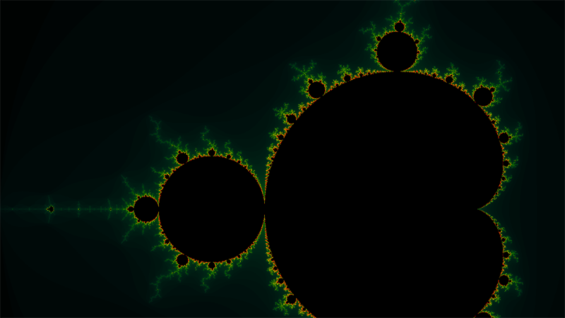

# Mandelbrot image generator

 |
--------------- |

A simple mandelbrot renderer consisting of two parts: 
an image generation server and a command line client. The client allows for different server instances
to generate, in parallel, different parts of the mandelbrot set and combines them into one image.
The resulting image is encoded as a binary PGM (portable grayscale map).

### Build

#### Prerequisites

* [JDK 8](http://www.oracle.com/technetwork/java/javase/downloads/jdk8-downloads-2133151.html)
* [Maven](https://maven.apache.org/index.html)

#### Compile

Navigate to the sub-project to compile and then execute the following Maven command:

$ `mvn clean install compile package`

### Use

#### Server

$ `java -jar target/api-1.0.0.jar`

Multiple instances can be started on different ports. Default port is 8080, but can be changed by adding a parameter: 
`--server.port=8080`.

Example usage: `java -jar target/api-1.0.0.jar --server.port=4444` 

#### Client

$ `java -jar target/cli-1.0.0.jar`

The client have many required arguments. The first four arguments determine the space to render, in this order:
`min_c_re`, `min_c_im`, `max_c_re`, `max_c_im`.
The next argument is the max amount of iterations permitted before escaping.
The two following arguments determine the resolution of the generated image, in this order: `width`, `height`.
The next argument determine the amount of image subdivisions to generate in parallel. Lastly, a variable length list 
of server URLs must be provided. The resulting image is saved as `output.pgm` in the working directory.

Example usage: `java -jar target/api-1.0.0.jar -1 -1.5 2 1.5 1024 10000 10000 4 http://localhost:4444 http://localhost:3333` 

### License

mandelbrot-image-generator is licensed under the MIT License (see [LICENSE](./blob/master/LICENSE) file).